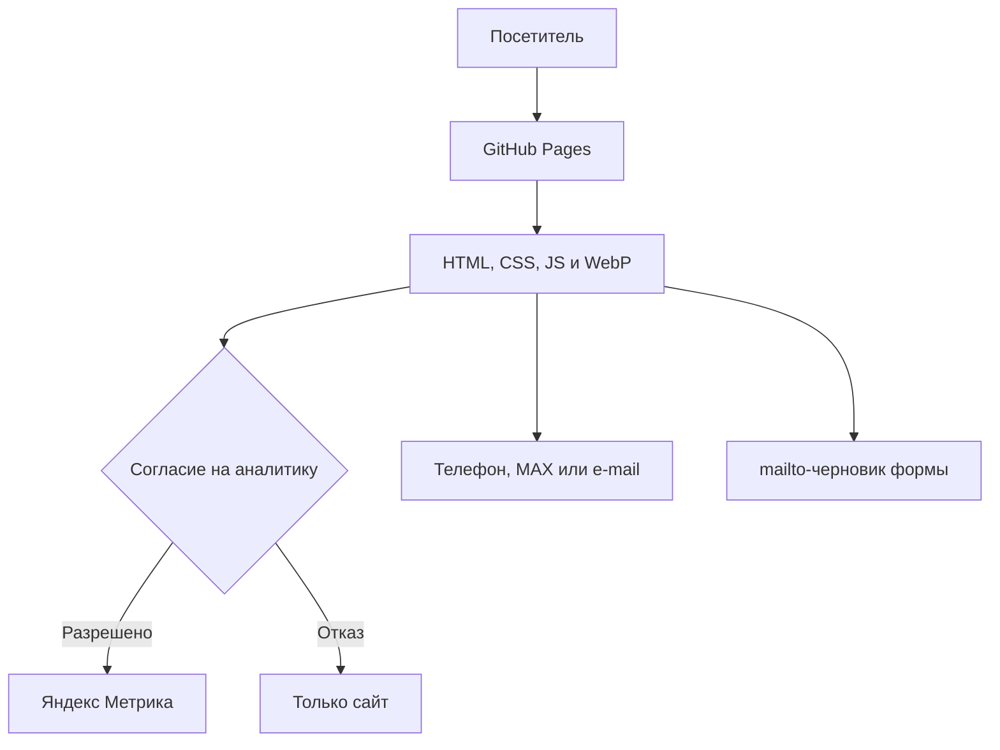
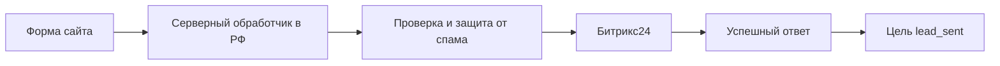

# FGN — Forrest Gamp Nutrition

Полная техническая документация официального сайта направления контрактного производства БАД и фасовки ООО «Бурундук Шоп».

- Публичный сайт: <https://mitsuoke.github.io/fgn-nn/>
- Репозиторий: <https://github.com/mitsuoke/fgn-nn>
- Рабочая ветка: `main`
- Тип проекта: статический многостраничный сайт
- Хостинг: GitHub Pages
- Язык интерфейса: русский
- Сборщик и пакетный менеджер: отсутствуют
- Серверная часть и база данных: отсутствуют

> Важно: сайт уже опубликован и используется как публичная версия FGN. Изменения в ветке `main` автоматически попадают на GitHub Pages. Перед редактированием необходимо прочитать разделы «Правила безопасных изменений» и «Проверка перед публикацией».

## 1. Назначение сайта

Сайт представляет FGN как собственный завод контрактного производства БАД и фасовки сухой продукции в Нижегородской области.

Основные задачи сайта:

1. объяснить услуги простым языком;
2. подтвердить наличие собственного производства, оборудования и документов;
3. показать, что FGN работает как с готовым техническим заданием, так и с идеей заказчика;
4. получить первичное обращение по телефону, e-mail или через MAX;
5. привлекать органический трафик на отдельные коммерческие страницы;
6. не создавать медицинских, юридических или коммерческих обещаний, которые не закреплены договором и техническим заданием.

Целевая аудитория:

- новый бренд без опыта производства;
- продавец, готовящий продукт к маркетплейсам;
- действующий бренд БАД;
- заказчик, которому нужна отдельная операция: капсулирование, фасовка или упаковка.

## 2. Подтверждённые данные компании

Эти сведения используются в публичных текстах и являются исходной точкой для разработчика. Их нельзя произвольно менять или расширять без подтверждения владельца сайта.

| Параметр | Значение |
| --- | --- |
| Бренд | FGN — Forrest Gamp Nutrition |
| Юридическое лицо | ООО «Бурундук Шоп» |
| ИНН | 5257195209 |
| ОГРН | 1205200004250 |
| Начало производства | 2023 год |
| Выпущено | более 1 000 000 банок |
| Минимальная партия капсул | от 100 банок |
| Мощность капсулирования | до 5 000 банок по 60 капсул за смену |
| Мощность фасовки | до 15 000 пакетов сухой продукции в сутки |
| Масштабирование | возможна работа до трёх смен |
| Производство | Нижегородская область, г. Павлово, пер. Правика, д. 2а |
| Юридический адрес | г. Нижний Новгород, Комсомольское шоссе, д. 3, склад 77 |
| Телефон | +7 906 578-74-13 |
| E-mail | Burunduk.shop@mail.ru |
| MAX | публичная ссылка указана в HTML-файлах |
| СГР | БАД с ежовиком гребенчатым, № RU.77.99.88.003.R.003617.12.25 |
| ISO | добровольный сертификат № 12AP64-1 |

Ограничения формулировок:

- СГР относится только к указанному продукту и не подтверждает регистрацию других продуктов;
- ISO выдан в добровольной системе и действует только в пределах указанной области сертификации;
- сроки, стоимость, состав работ и результат окончательно определяются договором и техническим заданием;
- примеры банок демонстрируют производственные возможности и не являются медицинской рекламой;
- предупреждение «БАД. Не является лекарственным средством» должно оставаться заметным рядом с примерами продукции.

## 3. Техническая архитектура

Проект состоит из обычных HTML-, CSS- и JavaScript-файлов. GitHub Pages отдаёт их напрямую браузеру.



В текущей версии отсутствуют:

- серверное приложение;
- CMS или административная панель;
- база данных;
- автоматическая отправка формы;
- интеграция с Битрикс24;
- авторизация пользователей;
- платёжные функции;
- npm-зависимости и процесс сборки.

Это сознательно простая архитектура. Любой секрет, добавленный в HTML или JavaScript, становится публичным. Токены, пароли и вебхуки нельзя хранить в этом репозитории.

## 4. Структура репозитория

```text
fgn-nn/
├── index.html
├── start.html
├── privacy.html
├── consent.html
├── styles.css
├── start-product.css
├── commercial-pages.css
├── script.js
├── commercial-pages.js
├── robots.txt
├── sitemap.xml
├── .nojekyll
├── .gitignore
├── README.md
├── assets/
│   ├── fonts/
│   │   ├── manrope-variable.ttf
│   │   └── OFL.txt
│   ├── hero-production.webp
│   ├── process-*.webp
│   ├── product-*.webp
│   ├── sgr-preview.webp
│   └── iso-22000-preview.webp
├── kapsulirovanie/
│   └── index.html
├── fasovka-sypuchih-produktov/
│   └── index.html
└── kontraktnoe-proizvodstvo-bad/
    └── index.html
```

### Назначение файлов

| Файл или каталог | Назначение |
| --- | --- |
| `index.html` | Главная страница, основная форма обращения, услуги, производство, мощности, документы и контакты |
| `start.html` | Страница «Запустить продукт» для посетителя, которому нужна помощь от идеи до партии |
| `kapsulirovanie/index.html` | SEO-страница услуги капсулирования |
| `fasovka-sypuchih-produktov/index.html` | SEO-страница фасовки сухих смесей, порошков, чая и сырья |
| `kontraktnoe-proizvodstvo-bad/index.html` | SEO-страница полного цикла контрактного производства БАД |
| `privacy.html` | Политика обработки персональных данных и описание аналитики |
| `consent.html` | Текст отдельного согласия для отправителя обращения |
| `styles.css` | Базовый дизайн, главная страница, общие компоненты, мобильное меню, cookies и юридические страницы |
| `start-product.css` | Дополнительная сетка и адаптивность страницы запуска продукта |
| `commercial-pages.css` | Компоненты коммерческих страниц, FAQ и мобильная панель связи |
| `script.js` | Навигация, анимации, Метрика, согласие на аналитику, цели, форма, текущий год и FAQ |
| `commercial-pages.js` | Поведение FAQ на коммерческих страницах; оставлен отдельным файлом для явной изоляции компонента |
| `robots.txt` | Правила обхода и адрес карты сайта |
| `sitemap.xml` | Индексируемые коммерческие страницы |
| `.nojekyll` | Запрещает GitHub Pages обрабатывать проект через Jekyll |
| `.gitignore` | Исключает секреты, ключи, архивы, резервные и системные файлы |
| `assets/` | Локальные шрифты, фотографии, изображения товаров и защищённые превью документов |

## 5. Карта страниц

| Страница | URL | Главная задача |
| --- | --- | --- |
| Главная | `/fgn-nn/` | Представить производство и привести к обращению |
| Запустить продукт | `/fgn-nn/start.html` | Объяснить запуск продукта новому или действующему бренду |
| Капсулирование | `/fgn-nn/kapsulirovanie/` | Получить запрос на капсулирование от 100 банок |
| Фасовка сухой продукции | `/fgn-nn/fasovka-sypuchih-produktov/` | Получить запрос на фасовку смесей, порошков, чая и сырья |
| Контрактное производство БАД | `/fgn-nn/kontraktnoe-proizvodstvo-bad/` | Получить запрос на полный цикл производства |
| Политика | `/fgn-nn/privacy.html` | Описать порядок обработки данных и аналитику |
| Согласие | `/fgn-nn/consent.html` | Зафиксировать условия согласия отправителя обращения |

Юридические страницы намеренно не включены в `sitemap.xml`: они доступны пользователям и поисковым роботам по ссылкам, но не являются коммерческими посадочными страницами.

## 6. Навигация и связи между страницами

На главной странице коммерческие направления представлены карточками с кнопкой «Подробнее». Дополнительные ссылки находятся в подвале.

Коммерческие страницы содержат:

- ссылку на главную;
- переход к другим услугам;
- переход на `start.html`;
- телефон, e-mail и MAX;
- ссылки на политику и согласие;
- кнопку повторного открытия настроек аналитики.

В мобильном меню нет вложенного выпадающего меню услуг. Это сделано намеренно, чтобы навигация оставалась простой.

При добавлении ссылки из страницы в корне используется путь вида `kapsulirovanie/`. Из вложенной страницы требуется путь `../kapsulirovanie/` или `../index.html`. Ошибка в количестве `../` — самая вероятная причина сломанной навигации.

## 7. Дизайн-система

Сайт следует фирменной стилистике FGN.

### Основные переменные

Переменные определены в начале `styles.css`:

```css
:root {
  --blue: #111b67;
  --blue2: #6471cd;
  --lav: #d9dcf2;
  --ink: #1e1e1e;
  --muted: #707386;
  --line: #dcdde6;
  --off: #f7f7fa;
  --max: 1240px;
}
```

Основной шрифт — Manrope. Он хранится локально в `assets/fonts/` и подключается через `@font-face`. Внешние веб-шрифты не используются.

### Адаптивные пороги

| Ширина | Назначение |
| --- | --- |
| до `1050px` | переход от десктопной навигации и крупных сеток к планшетной компоновке |
| до `760px` | основная мобильная компоновка, мобильное меню и фиксированная панель связи |
| до `700px` | вертикальная компоновка уведомления об аналитике |
| до `430px` | компактная версия для узких телефонов |

Дополнительно реализован `prefers-reduced-motion: reduce`: анимации отключаются для пользователей, попросивших уменьшить движение.

### Визуальные инварианты

Без отдельного согласования нельзя:

- менять порядок секций главной страницы;
- заменять цветовую систему;
- менять логотип или написание бренда;
- удалять мобильную нижнюю панель «Позвонить / MAX»;
- превращать меню в многоуровневое;
- заменять реальные фотографии сгенерированными изображениями;
- удалять блоки документов, юридические пояснения или предупреждение о БАД;
- менять тексты и подтверждённые показатели ради заполнения дизайна.

При точечной правке сначала меняется содержимое существующего компонента. Новая структура вводится только тогда, когда старый компонент объективно не решает задачу.

## 8. JavaScript

Проект использует нативный JavaScript без библиотек.

### `script.js`

Файл отвечает за:

1. изменение вида шапки после прокрутки;
2. открытие и закрытие мобильного меню;
3. блокировку прокрутки страницы при открытом меню;
4. анимацию элементов `.reveal` через `IntersectionObserver`;
5. запрос согласия на Яндекс Метрику;
6. сохранение и изменение выбора аналитики;
7. удаление доступных first-party данных Метрики после отказа;
8. регистрацию целей Метрики;
9. подготовку e-mail по данным формы;
10. автоматический вывод текущего года;
11. работу раскрывающихся FAQ по принципу «открыт один ответ».

Все обращения к DOM написаны с безопасными проверками (`?.` или проверка существования элемента). Благодаря этому один и тот же `script.js` работает на страницах с разным набором компонентов.

### `commercial-pages.js`

Файл закрывает остальные элементы FAQ при раскрытии нового ответа. Аналогичная защитная логика присутствует в общем скрипте; при дальнейшей переработке допускается объединить реализацию, но только после проверки всех коммерческих страниц.

### Поддерживаемые браузеры

Код рассчитан на актуальные версии Chrome, Яндекс Браузера, Safari, Firefox и Edge. Используются:

- optional chaining;
- `IntersectionObserver` с резервным показом контента;
- `FormData`;
- `localStorage`;
- CSS Grid, Flexbox и `env(safe-area-inset-bottom)`.

Поддержка Internet Explorer не предусмотрена.

## 9. Форма обращения

Форма находится только на главной странице и имеет ID `request-form`.

Поля:

| Имя поля | Назначение | Обязательное |
| --- | --- | --- |
| `name` | имя посетителя | да |
| `contact` | телефон или e-mail | да |
| `product` | тип продукта или задачи | нет, есть значение по умолчанию |
| `volume` | планируемая партия | нет |
| `material` | состояние вопроса с сырьём | нет, есть значение по умолчанию |
| `message` | комментарий | нет |
| `personal_data_consent` | отдельное согласие | да |

### Текущее поведение

Форма не отправляет данные на сервер. После валидации браузера `script.js`:

1. предотвращает обычную отправку формы;
2. собирает значения через `FormData`;
3. создаёт тему и текст письма;
4. добавляет отметку о согласии и дату редакции согласия;
5. открывает `mailto:` на `Burunduk.shop@mail.ru`;
6. показывает посетителю пояснение, что письмо нужно отправить вручную.

Событие `email_draft_open` означает только открытие черновика. Оно не подтверждает отправку или получение письма.

### Известное ограничение

Если на устройстве не настроена почтовая программа, `mailto:` может не открыть понятный интерфейс. Заявка не сохраняется, а компания не получает резервную копию.

### Правильная будущая интеграция с Битрикс24

Браузер не должен обращаться к секретному вебхуку Битрикс24 напрямую.



Серверный обработчик должен:

- работать на инфраструктуре, подходящей для первичного хранения персональных данных;
- принимать только ожидаемые поля;
- проверять длину и формат значений на сервере;
- ограничивать частоту запросов;
- защищать форму от автоматического спама;
- хранить секрет Битрикс24 в переменной окружения;
- возвращать однозначный успешный или ошибочный статус;
- не записывать персональные данные в открытые технические логи;
- иметь резервный канал уведомления при ошибке CRM.

После подключения необходимо:

1. заменить обработчик `mailto:` на запрос к серверу;
2. показывать понятное состояние загрузки;
3. блокировать повторную отправку во время запроса;
4. вызывать цель `lead_sent` только после успешного ответа сервера;
5. обновить `privacy.html` и `consent.html` до запуска;
6. проверить российское место первичного хранения заявок;
7. протестировать попадание всех полей в нужную воронку Битрикс24.

## 10. Яндекс Метрика и согласие на аналитику

На сайте используется счётчик Яндекс Метрики № `111744945`.

Код Метрики не находится напрямую в HTML. Он динамически добавляется функцией `loadMetrika()` только после нажатия «Разрешить аналитику».

### Хранение выбора

В `localStorage` используется ключ:

```text
fgn_analytics_consent
```

Значение хранится как JSON:

```json
{
  "status": "granted",
  "decidedAt": 1787212800000,
  "expiresAt": 1818748800000
}
```

Допустимые статусы:

- `granted` — аналитика разрешена;
- `denied` — аналитика отклонена.

Срок действия выбора — 365 дней. По истечении срока уведомление показывается снова.

Кнопка «Настройки cookies» в подвале повторно открывает уведомление. При новом отказе вызывается `ym(..., 'destruct')` и удаляются доступные first-party cookies и ключи `localStorage`, начинающиеся с `_ym`.

### Цели

| Идентификатор | Событие |
| --- | --- |
| `phone_click` | переход по ссылке `tel:` |
| `max_click` | переход на `max.ru` |
| `email_click` | переход по обычной ссылке `mailto:` |
| `start_product_click` | переход на `start.html` |
| `email_draft_open` | подготовка черновика письма из формы |

Для каждой цели в интерфейсе Метрики используется тип «Целевое событие / JavaScript-событие», а идентификатор должен полностью совпадать с таблицей.

Метрика получает цель только если посетитель разрешил аналитику и счётчик успел загрузиться. Содержимое формы в параметры целей не передаётся. Вебвизор в коде не включён.

### Проверка Метрики

1. Открыть сайт в чистом профиле браузера.
2. Убедиться, что до согласия запрос к `mc.yandex.ru/metrika/tag.js` отсутствует.
3. Нажать «Разрешить аналитику».
4. Проверить наличие счётчика `111744945` через официальный отладчик или панель разработчика.
5. Нажать телефон, e-mail, MAX и переход на страницу запуска.
6. Проверить цели в отчёте Метрики с учётом задержки обработки.
7. Открыть «Настройки cookies», выбрать отказ и убедиться, что при следующей загрузке скрипт не запускается.

## 11. SEO

Каждая коммерческая страница содержит:

- уникальный `<title>`;
- уникальный `meta description`;
- один основной `<h1>`;
- canonical URL;
- Open Graph-разметку;
- логичную иерархию заголовков;
- внутренние ссылки;
- описательные `alt` у содержательных изображений;
- структурированные данные Schema.org там, где они предусмотрены шаблоном.

Главная содержит JSON-LD типа `Organization` с юридическими данными, телефоном, e-mail и адресами.

### `sitemap.xml`

В карту включены пять индексируемых страниц:

1. главная;
2. запуск продукта;
3. капсулирование;
4. фасовка сухих продуктов;
5. контрактное производство БАД.

При создании коммерческой страницы необходимо добавить её в `sitemap.xml`, обновить `lastmod`, дать на неё внутреннюю ссылку и проверить canonical.

### `robots.txt`

Сейчас обход разрешён для всего сайта, а карта сайта указана абсолютным URL GitHub Pages.

### Миграция на собственный домен

После привязки `fgn-nn.ru` требуется одной задачей заменить все временные адреса GitHub Pages:

- canonical во всех индексируемых HTML-файлах;
- `og:url`;
- абсолютный `og:image`;
- `url` в JSON-LD;
- адреса в `sitemap.xml`;
- директиву `Sitemap` в `robots.txt`;
- адрес сайта в этом README;
- адрес сайта в настройках Яндекс Метрики и Вебмастера.

Затем необходимо:

1. добавить файл `CNAME` с доменом, если сайт остаётся на GitHub Pages;
2. корректно настроить DNS;
3. дождаться выпуска сертификата;
4. включить `Enforce HTTPS`;
5. проверить обе версии: с `www` и без него;
6. выбрать одну основную версию и настроить перенаправление;
7. не удалять почтовые MX-, SPF-, DKIM- и проверочные TXT-записи домена;
8. отправить новый sitemap в Яндекс Вебмастер;
9. проверить отсутствие дублей старого и нового адресов.

## 12. Юридические страницы и требования к контенту

### `privacy.html`

Политика описывает:

- оператора персональных данных;
- категории и цели обработки;
- работу текущей формы;
- сроки и способы обработки;
- Яндекс Метрику и данные браузера;
- права пользователя;
- порядок обращения и отзыва согласия.

### `consent.html`

Согласие связано с обращением через форму. Чекбокс не должен быть заранее отмечен. Ссылка на согласие и ссылка на политику выполняют разные функции и должны оставаться отдельными.

При изменении состава полей, способа отправки, получателей или CRM необходимо до публикации проверить обе юридические страницы и дату редакции согласия в `script.js`.

### Правила публичного контента

- не публиковать обещания лечения, профилактики заболеваний или гарантированного эффекта;
- не использовать неподтверждённые превосходные степени;
- не обещать фиксированный срок без оговорки о готовности рецептуры, сырья, упаковки и документов;
- не называть услугу бесплатной без точных условий;
- не публиковать логотипы, этикетки и продукты заказчика без разрешения;
- не публиковать исходные документы с лишними персональными данными;
- не переносить на сайт цены без подтверждения их актуальности;
- не представлять добровольный сертификат как государственную регистрацию;
- сохранять пометку о том, что информация не является публичной офертой.

Тексты сайта не заменяют внутренние документы компании, договор, техническое задание и профессиональную юридическую проверку.

## 13. Безопасность

### Реализовано

- локальный шрифт без обращения к Google Fonts;
- базовая Content Security Policy в HTML;
- `Referrer-Policy`;
- `object-src 'none'`;
- ограничение `base-uri` и источников ресурсов;
- `rel="noopener"` для внешних ссылок, открывающихся в новой вкладке;
- аналитика только после согласия;
- отсутствие секретов и серверных токенов в коде;
- `.gitignore` для распространённых секретов, ключей и архивов;
- превью СГР и ISO уменьшены и защищены водяными знаками;
- данные формы не отправляются в Метрику;
- сайт не хранит заявки в браузере или репозитории.

### Ограничения GitHub Pages

Meta-тег CSP полезен, но не заменяет полноценные HTTP-заголовки. GitHub Pages не даёт проекту полностью управлять серверными заголовками.

После перехода на управляемый хостинг или CDN желательно настроить на уровне ответа:

- `Content-Security-Policy`;
- `Strict-Transport-Security`;
- `X-Content-Type-Options: nosniff`;
- `Referrer-Policy`;
- `Permissions-Policy`;
- запрет встраивания сайта во фрейм через `frame-ancestors`.

### Никогда не добавлять в репозиторий

- `.env` и его копии;
- токены Битрикс24;
- секретные URL вебхуков;
- пароли от почты, домена и Метрики;
- приватные и API-ключи;
- банковские реквизиты, если их публикация не согласована отдельно;
- исходные сканы документов без подготовки;
- базы заявок и выгрузки клиентов;
- резервные ZIP-архивы сайта.

Если секрет попал в GitHub, простого удаления из последнего коммита недостаточно: его нужно немедленно отозвать, заменить и очистить историю репозитория.

## 14. Доступность

В проекте уже предусмотрены:

- ссылка перехода к основному содержимому;
- семантические `header`, `main`, `section`, `nav`, `footer`;
- один `h1` на основной странице;
- `aria-label` у навигации и интерактивных областей;
- `aria-expanded` у мобильного меню;
- `aria-live` для сообщения формы;
- видимые состояния клавиатурного фокуса;
- нативные `<details>` и `<summary>` для FAQ;
- обязательные `label` у полей формы;
- поддержка `prefers-reduced-motion`;
- текстовые названия действий вместо кнопок только с иконками.

При изменениях следует проверить:

1. управление Tab и Shift+Tab;
2. закрытие и открытие меню с клавиатуры;
3. контраст текста и кнопок;
4. масштаб страницы до 200%;
5. понятность `alt` у новых изображений;
6. отсутствие передачи смысла только цветом;
7. корректное чтение формы скринридером.

## 15. Производительность и изображения

Все основные фотографии хранятся в WebP. Крупные изображения производства имеют размер до 1800×1200, карточки продукции — 720×1080. Большинство изображений ниже первого экрана использует `loading="lazy"`.

Правила добавления изображений:

- использовать реальные фотографии производства и продукции;
- удалять EXIF и геометки перед публикацией;
- конвертировать фото в WebP;
- не загружать оригиналы в десятки мегабайт;
- сохранять достаточное качество этикеток и оборудования;
- указывать фактические `width` и `height`, если компонент позволяет это без изменения дизайна;
- писать конкретный `alt`, если изображение несёт смысл;
- использовать пустой `alt=""` для чисто декоративной графики;
- для документов публиковать только подготовленное превью с водяным знаком.

После замены изображения сохранить прежнее имя файла можно только с одновременной проверкой кэша. Надёжнее увеличить версию подключаемого ресурса или использовать новое имя.

## 16. Локальный запуск

Сборка не требуется. Нельзя открывать HTML двойным щелчком и считать это полноценным тестом: некоторые браузерные ограничения ведут себя иначе при `file://`.

Из корня проекта запустить локальный сервер:

```bash
python3 -m http.server 8000
```

Открыть:

```text
http://localhost:8000/
```

Основные адреса для проверки:

```text
http://localhost:8000/
http://localhost:8000/start.html
http://localhost:8000/kapsulirovanie/
http://localhost:8000/fasovka-sypuchih-produktov/
http://localhost:8000/kontraktnoe-proizvodstvo-bad/
http://localhost:8000/privacy.html
http://localhost:8000/consent.html
```

Остановить сервер: `Ctrl+C`.

## 17. Проверка перед публикацией

### Синтаксис JavaScript

```bash
node --check script.js
node --check commercial-pages.js
```

### Поиск случайных секретов

```bash
rg -n --hidden -i "api[_-]?key|secret|token|webhook|password|bearer" \
  -g '!README.md' -g '!.git/**'
```

Каждое совпадение нужно проверить вручную. Само наличие слова ещё не означает утечку.

### Проверка HTTP-ответов локально

При запущенном сервере:

```bash
for url in \
  / \
  /start.html \
  /kapsulirovanie/ \
  /fasovka-sypuchih-produktov/ \
  /kontraktnoe-proizvodstvo-bad/ \
  /privacy.html \
  /consent.html \
  /styles.css \
  /script.js \
  /sitemap.xml \
  /robots.txt
do
  curl -fsS -o /dev/null -w "%{http_code} $url\n" "http://localhost:8000$url" || exit 1
done
```

Все ответы должны иметь код `200`.

### Обязательная ручная проверка

Проверить минимум на ширинах 1440, 1024, 768, 430 и 360 пикселей:

- все страницы открываются;
- горизонтальная прокрутка отсутствует;
- шапка и мобильное меню не перекрывают контент;
- открытое меню хорошо видно и блокирует фон;
- нижняя мобильная панель не закрывает форму, FAQ и cookies;
- карточки «Подробнее» ведут на правильные страницы;
- FAQ раскрывается, и одновременно открыт не более одного ответа;
- телефон открывает вызов;
- MAX открывается в новой вкладке;
- e-mail открывает почтовую программу;
- форма требует имя, контакт и согласие;
- после формы открывается заполненный черновик, а не имитируется отправленная заявка;
- ссылки на политику и согласие доступны со всех основных страниц;
- «Настройки cookies» повторно открывают выбор;
- Метрика не загружается до разрешения;
- после отказа выбор сохраняется;
- предупреждение о БАД и пояснения к сертификатам остаются заметными;
- изображения имеют правильные пропорции;
- нет пустых областей, скачков сетки и наложения текста.

### SEO-проверка

- один `h1` на каждой коммерческой странице;
- уникальные `title` и `description`;
- canonical соответствует фактическому адресу;
- Open Graph содержит правильные абсолютные URL;
- JSON-LD является валидным JSON;
- новая коммерческая страница есть в sitemap;
- внутренние ссылки не ведут на `404`;
- `robots.txt` указывает актуальный sitemap;
- юридические страницы не подменяют коммерческие заголовки;
- дата `lastmod` меняется только при содержательном обновлении страницы.

Для финальной оценки рекомендуется Lighthouse в Chrome DevTools: Performance, Accessibility, Best Practices и SEO. Мобильный прогон обязателен.

## 18. Публикация

GitHub Pages публикует корень ветки `main`.

Рекомендуемый порядок через Git:

```bash
git pull --ff-only origin main
git status
git diff --check
git diff
git add README.md
git commit -m "Document FGN website architecture"
git push origin main
```

Для функциональных изменений в `git add` следует перечислять точные файлы, а не использовать `git add .` без проверки.

После отправки:

1. убедиться, что коммит появился в `main`;
2. дождаться обновления GitHub Pages;
3. открыть сайт в приватном окне;
4. проверить главную и изменённую страницу;
5. проверить мобильную версию;
6. проверить консоль браузера и сетевые ошибки;
7. при необходимости выполнить жёсткое обновление кэша.

GitHub Pages и CDN могут показывать предыдущую версию несколько минут.

### Версионирование CSS и JavaScript

HTML подключает ресурсы с query-параметром, например:

```html
<link rel="stylesheet" href="styles.css?v=10">
<script src="script.js?v=6" defer></script>
```

После изменения CSS или JavaScript увеличить номер версии во всех HTML-файлах, которые подключают изменённый файл. Иначе часть посетителей может получить новый HTML со старым кэшированным кодом.

### Откат

Безопасный откат опубликованного изменения выполняется новым коммитом:

```bash
git log --oneline --max-count=10
git revert <SHA_ошибочного_коммита>
git push origin main
```

Не использовать `git reset --hard` и принудительную отправку в `main` для обычного отката публичного сайта.

## 19. Как изменять существующую страницу

1. Получить актуальную ветку `main`.
2. Создать отдельную рабочую ветку для крупного изменения.
3. Определить единственный источник текста и фактов.
4. Изменить минимально необходимый набор файлов.
5. Не переписывать весь HTML ради одной фразы.
6. При изменении общего компонента проверить все страницы.
7. При изменении CSS или JS увеличить версию ресурса.
8. Выполнить полный чек-лист.
9. Просмотреть diff перед коммитом.
10. После публикации проверить реальный GitHub Pages, а не только локальный сервер.

## 20. Как добавить новую коммерческую страницу

Рекомендуемый формат — отдельный каталог с `index.html`:

```text
novaya-usluga/
└── index.html
```

Порядок:

1. взять ближайшую по структуре коммерческую страницу как шаблон;
2. заменить `title`, description, canonical, Open Graph и JSON-LD;
3. оставить общий header, footer, мобильную панель и cookies;
4. написать уникальный `h1` и содержательный текст услуги;
5. добавить процесс, возможности, ограничения, FAQ и призыв к обращению;
6. проверить все относительные пути `../`;
7. добавить ссылку с релевантной страницы или карточки главной;
8. добавить ссылку в подвал, только если список остаётся коротким;
9. добавить URL в `sitemap.xml`;
10. выполнить мобильную, SEO-, юридическую и техническую проверку.

Не создавать несколько почти одинаковых страниц только ради ключевых слов. Каждая страница должна отвечать на самостоятельный запрос клиента.

## 21. Правила безопасных изменений

Перед началом работы:

- не считать локальную копию актуальной без сравнения с `main`;
- проверить `git status` и не удалить чужие незавершённые изменения;
- не менять фотографии, дизайн и тексты за пределами задачи;
- не переименовывать файлы без обновления всех ссылок;
- не добавлять внешнюю библиотеку ради функции, реализуемой несколькими строками нативного кода;
- не внедрять сторонние трекеры без отдельного согласования и обновления политики;
- не подключать форму к бесплатному зарубежному сервису без проверки обработки персональных данных;
- не помещать конфиденциальные значения в код браузера.

Для крупной функции сначала описать:

1. какие файлы изменятся;
2. какие данные будут передаваться;
3. куда они будут передаваться и где храниться;
4. какое пользовательское поведение изменится;
5. как выполнить откат;
6. как будет подтверждён успешный результат.

## 22. Известные ограничения и будущие задачи

### Высокий приоритет после переноса домена

- заменить временные адреса GitHub Pages на `fgn-nn.ru` во всех SEO-настройках;
- включить HTTPS и проверить основную версию домена;
- подключить Яндекс Вебмастер;
- проверить Метрику на новом домене;
- создать почту на домене и заменить публичный адрес после проверки доставки;
- исключить одновременную индексацию старой и новой версии сайта.

### Высокий приоритет для заявок

- сделать серверную отправку формы;
- подключить Битрикс24 через защищённый backend;
- создать отдельную страницу или состояние успешной отправки;
- заменить `email_draft_open` на подтверждённую цель `lead_sent` после ответа сервера;
- предусмотреть резервную доставку и журнал технических ошибок без лишних персональных данных.

### Средний приоритет

- добавить ширину и высоту изображениям для уменьшения сдвигов макета;
- автоматизировать проверку локальных ссылок;
- добавить автоматическую HTML-валидацию;
- настроить защиту ветки `main`;
- включить двухфакторную аутентификацию владельца репозитория;
- проводить периодическую проверку внешних ссылок и данных сертификатов.

Административная панель на текущем этапе не требуется: контент меняется редко, а статическая архитектура дешевле, быстрее и безопаснее. CMS имеет смысл вводить только при регулярной публикации большого объёма материалов несколькими сотрудниками.

## 23. Типовые неисправности

### После публикации видна старая версия

- подождать несколько минут;
- выполнить жёсткое обновление;
- открыть приватное окно;
- проверить, увеличена ли версия CSS или JS;
- убедиться, что коммит действительно находится в `main`.

### Страница открывается, но стили пропали

Почти всегда причина — неправильный относительный путь. Для вложенной страницы общий файл подключается как `../styles.css`, а не `styles.css`.

### Мобильное меню незаметно или смешивается с формой

Проверить классы `.mobile-nav.open`, `body.menu-open`, z-index шапки, меню, cookies и нижней панели. Не удалять мобильные правила в конце `styles.css`: они специально усиливают фон и контраст открытого меню.

### Метрика не показывает визит

- проверить, было ли разрешено использование аналитики;
- убедиться, что браузер или блокировщик не режет `mc.yandex.ru`;
- проверить счётчик `111744945`;
- учитывать задержку отчётов;
- не ожидать цели, если посетитель отказался от аналитики.

### Кнопка формы ничего не отправила

Текущая кнопка создаёт черновик в почтовой программе. Она не является серверной отправкой. Проверить настройку почтового приложения на устройстве и предложить посетителю телефон, MAX или прямой e-mail.

### FAQ не раскрывается

Проверить, что разметка использует `<details class="faq-item">`, находится внутри `.faq-list`, а `script.js` и `commercial-pages.js` загружены без ошибок.

## 24. Ответственность за данные и интеграции

| Область | Текущий источник истины |
| --- | --- |
| Тексты и факты о производстве | владелец FGN |
| Юридические данные компании | карточка предприятия и официальные документы |
| СГР и ISO | опубликованные защищённые превью и исходные документы владельца |
| Код и структура сайта | ветка `main` репозитория |
| События аналитики | `script.js` и настройки счётчика № 111744945 |
| Список индексируемых страниц | `sitemap.xml` |
| Политика и согласие | `privacy.html` и `consent.html` |
| Будущие заявки CRM | серверный обработчик и Битрикс24 после подключения |

Разработчик не должен самостоятельно придумывать производственные показатели, юридические обещания, свойства БАД, сроки и цены.

## 25. Лицензии и материалы

- Manrope распространяется по лицензии SIL Open Font License; текст лицензии находится в `assets/fonts/OFL.txt`.
- Фотографии производства, продукции, логотип, документы и фирменные материалы принадлежат владельцу проекта или используются с его разрешения.
- Перед добавлением сторонней фотографии, иконки, шрифта или библиотеки необходимо проверить лицензию и сохранить требуемое уведомление.

## 26. Контакты проекта

- ООО «Бурундук Шоп»
- FGN — Forrest Gamp Nutrition
- Телефон: +7 906 578-74-13
- E-mail: Burunduk.shop@mail.ru
- Производство: Нижегородская область, г. Павлово, пер. Правика, д. 2а
- Репозиторий: <https://github.com/mitsuoke/fgn-nn>

---

Последнее содержательное обновление документации: 20.08.2026.

Главный принцип сопровождения проекта: сначала сохранить работающий и понятный сайт, затем добавить ровно то, что действительно нужно бизнесу. Простота здесь — часть архитектуры, а не отсутствие возможностей.
